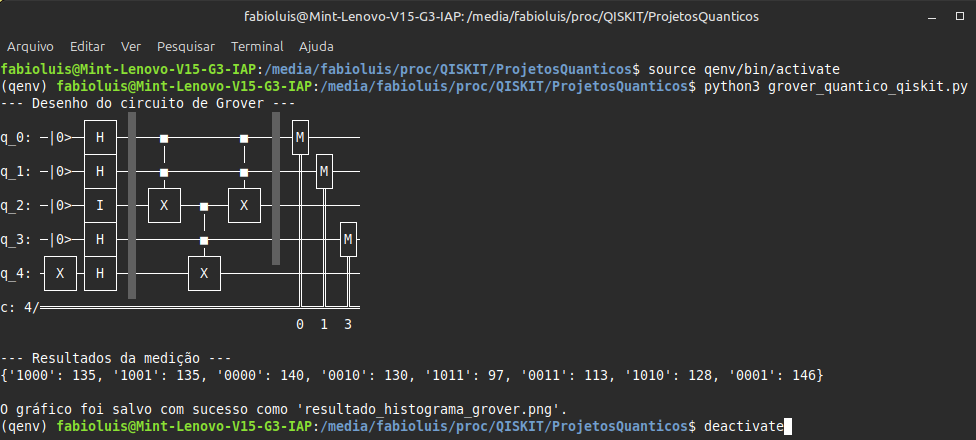
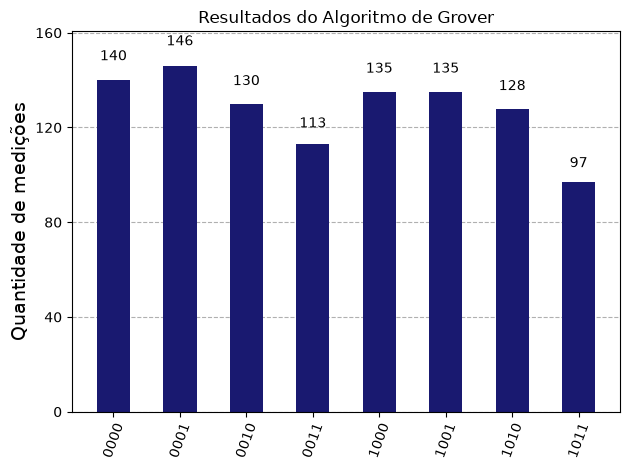
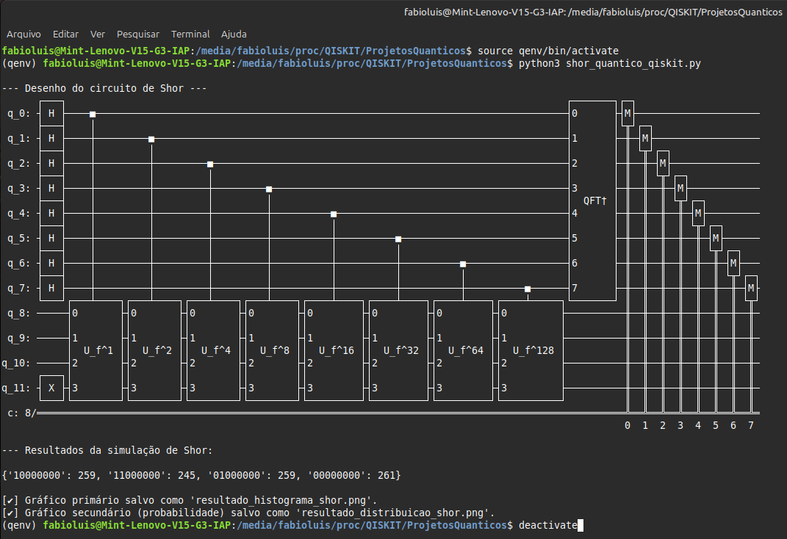
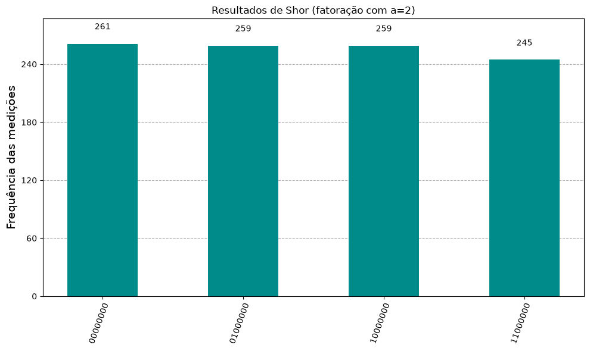
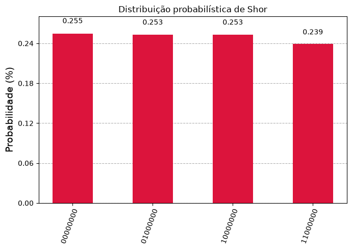

# QISKITquantumPrograming

Repositório dedicado aos estudos práticos e desenvolvimento de algoritmos de computação quântica utilizando o ecossistema **Qiskit 1.x**.

O projeto foi estruturado com base nos conceitos teóricos de Renato Portugal (2019) e adaptado para as práticas de programação quântica modernas, sendo amplamente testado e otimizado para execução local.

## 🚀 Tecnologias utilizadas

- **Sistema operacional:** Linux Mint 22.1 (Xia) / Ubuntu 24.04 LTS
- **Linguagem:** Python 3.12.3
- **Framework quântico:** Qiskit e Qiskit-Aer (Simulador)
- **Visualização:** Matplotlib
- **IDE:** Visual Studio Code

## 💻 Instalação e configuração

Devido às restrições de segurança do Python no Linux Mint 22.1 (PEP 668), é estritamente recomendado rodar o projeto dentro de um ambiente virtual.

**1. Instale as dependências de sistema:**

```bash
sudo apt update
sudo apt install python3-venv python3-pip -y
```

**2. Crie o ambiente virtual:**

```bash
python3 -m venv qenv
```

**3. Ative o ambiente virtual:**

```bash
source qenv/bin/activate
```

_(Nota: O ambiente `qenv` deve ser reativado sempre que abrir um novo terminal para rodar os scripts deste repositório. Durante sua utilização o nome do ambiente permanecerá no início da linha do terminal)._

**4. Instale as bibliotecas requeridas:**

```bash
pip install qiskit qiskit-aer matplotlib
```

## 📂 Estrutura do projeto

Este repositório contém a implementações de diferentes circuitos quânticos:

- **`meu_primeiro_circuito.py` (Estado de Bell):** Demonstra os fenômenos de superposição (Porta Hadamard) e emaranhamento quântico (Porta CNOT) entre dois qubits, retornando resultados estatísticos próximos a 50% para `00` e `11`.

- **Algoritmo de Grover:** Implementação de busca em banco de dados não ordenado utilizando oráculos e reflexão de amplitude.

- **Algoritmo de Shor:** Rotina de fatoração de números baseada no cálculo da ordem quântica.

**5. Execute o projeto:**

```bash
python3 meu_primeiro_circuito.py

```


**6. Encerre o ambiente:**

Após terminar, finalize o ambiente virtual.

```bash
deactivate

```


## 🔀 Algoritmo de Grover

- **`grover_quantico_qiskit.py` (Algoritmo de Grover):** Demonstra o algoritmo implementado.

- **Algoritmo de Grover:** Implementação de busca em banco de dados não ordenado utilizando oráculos e reflexão de amplitude.

- O circuito utiliza 5 qubits (incluindo qubits auxiliares) e constrói a solução através da criação inicial de uma superposição uniforme, seguida pela aplicação de um oráculo (utilizando portas Toffoli para marcação de fase) e pela reflexão de amplitude.

- O script executa a simulação e gera um histograma que destaca visualmente a alta probabilidade estatística do elemento buscado após o colapso da função de onda.

**5. Execute o projeto:**

```bash
python3 grover_quantico_qiskit.py

```



**6. Encerre o ambiente:**

Após terminar, finalize o ambiente virtual.

```bash
deactivate

```



## 🧮 Algoritmo de Shor

- **`shor_quantico_qiskit.py` (Algoritmo de Shor):**
  Implementação focada na fatoração de números inteiros, com demonstração prática para $N=15$.

- O circuito utiliza 12 qubits no total (8 para contagem e 4 auxiliadores) e constroí a solução através de um oráculo de exponenciação modular controlada seguindo pela Transformada de Fourier Quântica Inversa (IQFT ou QFT†) para extração do período da função.

- O script gera gráficos de histograma e distribuição propabilística para evidencia os picos de interferência construtiva.

**5. Execute o projeto:**

```bash
python3 shor_quantico_qiskit.py

```



**6. Encerre o ambiente:**

Após terminar, finalize o ambiente virtual.

```bash
deactivate

```





## 🛠️ Resolução de problemas comuns (Troubleshooting)

- **Erro `ModuleNotFoundError: No module named 'qiskit'`:** Isso ocorre se a pasta do projeto for renomeada ou movida. Ambientes virtuais quebram ao mudar de caminho. Solução: Apague a pasta `qenv`, crie-a novamente e reinstale as dependências.

- **Erro no método `get_counts`:** Certifique-se de grafar corretamente o método. O Qiskit não reconhece variações como `get_conts`.

- **Erro de importação na visualização:** No Qiskit moderno (1.x), a importação de gráficos ocorre via pacote principal (`from qiskit.visualization import plot_histogram`) e não pelo módulo `qiskit_aer`.

---

_Desenvolvido durante estudos de implementação de computação quântica._
